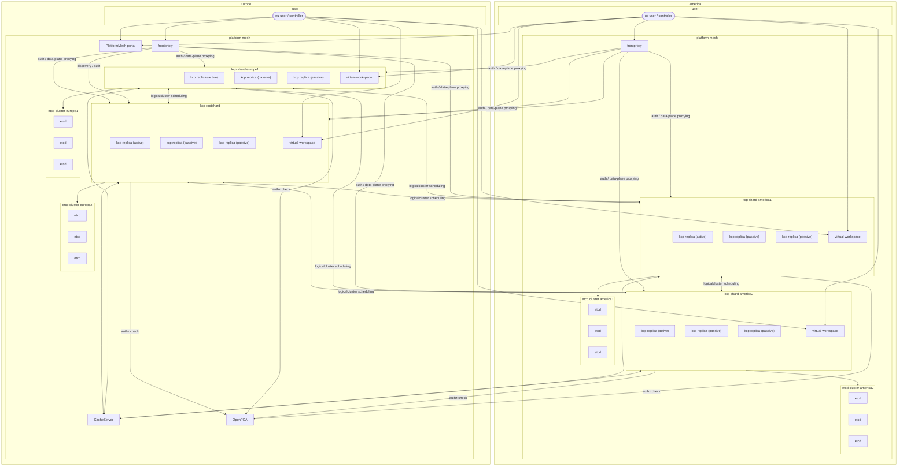

# Multi-Region Status Quo and Position

This paper explains the current status of multi-region support in platform-mesh. It does not touch on multi-zone support (see differentiation below).

## Differentiation: Region vs Zone

Regions are characterized by a significant geographical distance between them, resulting in round-trip times between 20-250ms. For example cross-continent, transatlantic or transpacific communication.

Zones are geographically redundant locations with round-trip times between >1-20ms. For example locations on the same continent, with private backbones.

## Status Quo - Global Control-Plane

In order to run PlatformMesh across multiple regions acting as a global control-plane, it is split on the kcp level using shards. A kcp shard connects to its own etcd cluster and a centrally run CacheServer. Additionally shards communicate with each other during scheduling of logicalclusters. A shard can have multiple replicas, with one being active. Shards can be deployed as part of Kubernetes clusters or on standalone infrastructure. Shards can be deployed as part of Kubernetes clusters or on standalone infrastructure.

Lastly a region can have multiple shards to extend its capacity horizontally.

Here is a simplified example of a two-region setup, with the region `Europe` acting as the global control plane.

## Resulting Next Steps

The following improvements to the current architecture should be made in the mid-term to improve its viability for multi-region to minimize and streamline cross-region connections in a global-control plane model.

* Build a distributed CacheServer
* Run distributed OpenFGA or allow for Kubernetes RBAC to be configurable in platform-mesh
* Make shards not talk to each other for scheduling logicalclusters
* Run portal distributed across regions, with a shared database or create per region portals

## Far Horizon

Multi-region setups need to minimize the amount of traffic and requests made between regions. In the long-term the global control-plane should take in more of an indexing role, providing clients with information how to connect to all regional control planes, similar to the Cloud Hyperscaler model.
