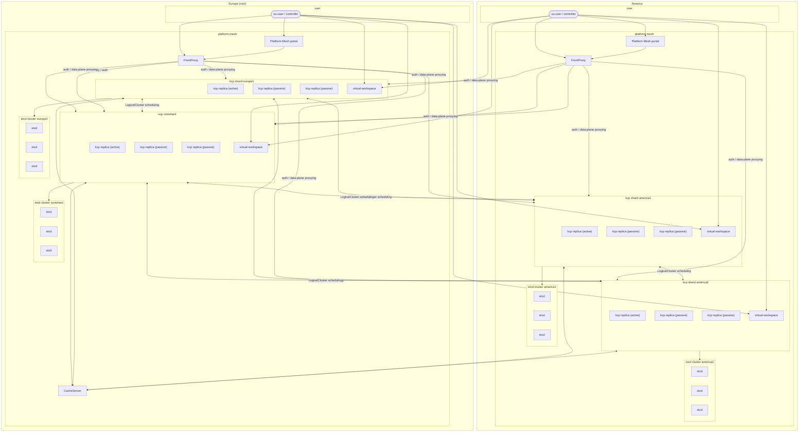

# Multi-Region Status Quo and Position

This paper explains the current status of multi-region support in Platform Mesh as well as outlines
future steps to be taken.

## Definition Region

Regions are sets of computing infrastructure which are separated from each other. How far regions
are separated from each other and resulting latencies depend on your needs and are not part of this
paper.

## Status Quo - Mandatory Root Region

This section describes what is possible with the latest version of Platform Mesh which is 0.5.0 at
the time of writing.

Currently, you will need to dedicate one region as a special root region for bootstrapping and
coordination. It will host the kcp RootShard as well as the kcp CacheServer, which stores
global information. Platform Mesh is split on the kcp level using shards. A kcp
shard connects to its own etcd cluster. Additionally, shards communicate with each other during
scheduling of LogicalClusters. Shards can be deployed as part of Kubernetes clusters or on
standalone infrastructure. Each region has its own dedicated kcp FrontProxy, which can access all
shards. Additionally, each region has its own dedicated Platform Mesh portal and its dependent
components graphql-gateway and extension-manager.

Here is an example of a two-region setup, with the region `Europe` acting as the root control-plane.

## Envisioned Future - Rootless Shards, Distributed Caches, and FrontProxy based scheduling

Rootless shards remove the need to have a root region. Instead each region contains the same set
of components and is not dependent on the root region anymore.

Distributed caches allow for shards to only connect to their local CacheServer instance to fetch
global objects. Distributed caches are responsible for replicating data amongst themselves, thus
reducing the amount of necessary connections.

FrontProxy based scheduling eliminates the need for shards to talk to each other for scheduling
LogicalClusters.

The aforementioned three workstreams result in a leaner multi-region setup. Returning to our example
of a two-region setup, we can see the simplified and resilient architecture:

```mermaid
flowchart TB
    subgraph America
        subgraph USUserGroup["user"]
            USUser(["us-user / controller"])
        end
        subgraph USPMesh["platform-mesh"]
            subgraph US1Shard["kcp shard america1"]
                US1Active["kcp replica (active)"]
                US1Passive1["kcp replica (passive)"]
                US1Passive2["kcp replica (passive)"]
                US1VW["virtual-workspace"]
            end
            subgraph US2Shard["kcp shard america2"]
                US2Active["kcp replica (active)"]
                US2Passive1["kcp replica (passive)"]
                US2Passive2["kcp replica (passive)"]
                US2VW["virtual-workspace"]
            end
            subgraph US1Etcd["etcd cluster america1"]
                US1Etcd1["etcd"]
                US1Etcd2["etcd"]
                US1Etcd3["etcd"]
            end
            subgraph US2Etcd["etcd cluster america2"]
                US2Etcd1["etcd"]
                US2Etcd2["etcd"]
                US2Etcd3["etcd"]
            end
            US1Shard --> US1Etcd
            US2Shard --> US2Etcd
            USCacheServer["CacheServer"]
            USFP["FrontProxy"]
            USPortal["Platform Mesh portal"]
            USPortal --> USFP
            US1Shard <--> USCacheServer
            US2Shard <--> USCacheServer
            USFP -->|auth / data-plane proxying| US1Shard
            USFP -->|auth / data-plane proxying| US2Shard
        end
    end

    subgraph Europe
        subgraph EUUserGroup["user"]
            EUUser(["eu-user / controller"])
        end
        subgraph EUPMesh["platform-mesh"]
            subgraph EU1Shard["kcp shard europe1"]
                EU1Active["kcp replica (active)"]
                EU1Passive1["kcp replica (passive)"]
                EU1Passive2["kcp replica (passive)"]
                EU1VW["virtual-workspace"]
            end
            subgraph EU2Shard["kcp shard europe2"]
                EU2Active["kcp replica (active)"]
                EU2Passive1["kcp replica (passive)"]
                EU2Passive2["kcp replica (passive)"]
                EU2VW["virtual-workspace"]
            end
            subgraph EU1Etcd["etcd cluster europe1"]
                EU1Etcd1["etcd"]
                EU1Etcd2["etcd"]
                EU1Etcd3["etcd"]
            end
            subgraph EU2Etcd["etcd cluster europe2"]
                EU2Etcd1["etcd"]
                EU2Etcd2["etcd"]
                EU2Etcd3["etcd"]
            end
            EUCacheServer["CacheServer"]
            EUPortal["Platform Mesh portal"]
            EUFP["FrontProxy"]

            EU1Shard --> EU1Etcd
            EU2Shard --> EU2Etcd
            EUPortal --> EUFP
            EU1Shard <--> EUCacheServer
            EU2Shard <--> EUCacheServer
            EUFP -->|auth / data-plane proxying| EU1Shard
            EUFP -->|auth / data-plane proxying| EU2Shard
        end
    end

    EUCacheServer <-->|cache cross-sync| USCacheServer
    EUFP -->|auth / data-plane proxying| US1Shard
    EUFP -->|auth / data-plane proxying| US2Shard
    USFP -->|auth / data-plane proxying| EU1Shard
    USFP -->|auth / data-plane proxying| EU2Shard
    EUUser --> EUFP
    EUUser --> EU1VW
    EUUser --> EU2VW
    EUUser --> US1VW
    EUUser --> US2VW
    EUUser --> EUPortal
    USUser --> USFP
    USUser --> EU1VW
    USUser --> EU2VW
    USUser --> US1VW
    USUser --> US2VW
    USUser --> USPortal
```

## Upcoming Work

These are the work items, which are required to build the envisioned future:

* [Root shard de-sharding](https://github.com/kcp-dev/kcp/issues/4336) -> will remove the need to
  have a singular region as the root region
* [Building a regional distributed CacheServer with
  cross-sync](https://github.com/platform-mesh/backlog/issues/362) -> will minimize traffic between
  regions and removes the current requirement to have a root region
* [Balanced LogicalCluster Scheduling for
  Multi-Shard](https://github.com/platform-mesh/backlog/issues/333) -> will minimize traffic between
  regions and eliminate the need for shards to talk to each other when scheduling LogicalClusters
* [kcp-operator v2](https://github.com/platform-mesh/backlog/issues/389) -> we will also need to
  adjust kcp-operator to simplify multi-region deployments

Furthermore, platform-mesh operators also will need to be fitted to take advantage of the new
architecture

## Out of Scope

Running OpenFGA and Keycloak across regions is out of scope for the Platform Mesh project. The
community are not experts in operating these components on a multi-region scale. However, with the
workstream of [modularization](https://github.com/platform-mesh/backlog/issues/290), which turns
Authorization and Authentication into pluggable modules, end-users will be more flexible in their
setups.

Additionally this paper is not concerned with running services on a multi-region scale from a
provider perspective. Doing so requires specific domain knowledge of the service itself, which has
to be made on a case-by-case basis by the provider.
