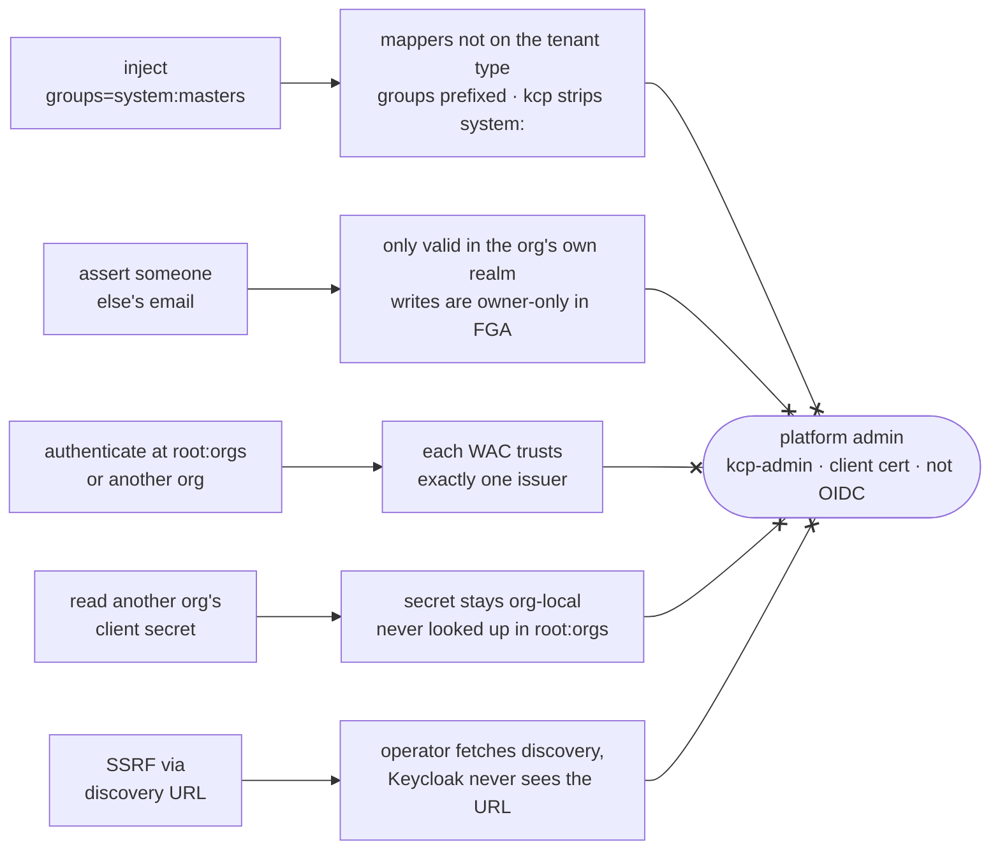
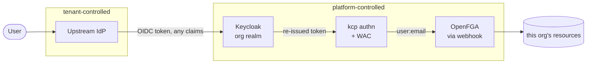
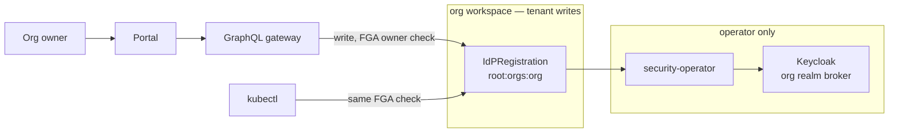

# Upstream IdP via intent CR

Notes on configuring upstream IdPs without opening up `root:orgs`.

Same idea as `APIExportPolicy`: actor writes intent in a workspace they own, security-operator does the privileged bit elsewhere. Unlike the first draft, the privileged bit is **Keycloak directly** — not a merge into IDPC in `root:orgs`.

## Decisions (locked)

1. **Kind:** `IdPRegistration` / plural `idpregistrations` (FGA relation length).
2. **Tenant type:** as in this design doc — purpose-built allowlist, **not** a verbatim wrap of `UpstreamIdentityProvider`.
3. **Tenant fields:** only what you need to configure an external OIDC IdP (see allowlist below).
4. **Platform realm vs tenant org:** separate them. The realm that gates `root:orgs` must not be a normal tenant org that can use this feature.
5. **Topology:** N OIDC brokers on the org Keycloak realm (not “one upstream + external federation hub”). Boris’ offload option: considered, rejected for Portal self-service + identity-first routing.
6. **Priority:** implement **Upstream IdP** (`IdPRegistration`) first — not `ClientRegistration`.
7. **Docs:** this design doc wins over older RFC wording (`verbatim`, Phase-1-only, IDPC merge). RFCs to be aligned to this.

**Architecture change vs first draft:** no write of tenant upstreams into `IdentityProviderConfiguration` in `root:orgs`. Org writes `IdPRegistration` in `root:orgs:<org>`; security-operator (admin kubeconfig) watches it and reconciles the Keycloak broker (+ Organizations) itself. IDPC stays for platform-managed realm bits (clients, seed/local Dex, flags). Alias ownership: IdPReg-managed aliases must not collide with IDPC/seed-managed ones.

## TL;DR

Org owners get to configure their own upstream IdP (corporate Azure AD, Google) without anyone handing them access to `root:orgs`. They write an `IdPRegistration` in their org workspace; the security-operator watches it and configures Keycloak. Today this needs an admin kubeconfig, and the planned Portal UI has nothing to call.

The security question is whether letting an org bring its own IdP lets someone become platform admin. It doesn't. Keycloak doesn't forward the upstream token — it validates it and issues its own, and nothing a tenant can configure influences what goes into that new token. Platform admin isn't an OIDC identity at all, it's a client cert.

Concretely, this is what the operator does differently from just accepting the tenant's object:

- **Field allowlist, not a struct copy.** The tenant type is its own type. Operator builds the Keycloak `IdentityProviderRepresentation` field by field from: `alias`, `displayName`, `enabled`, `hideOnLoginPage`, `emailDomainRouting`, `type`, and from the OIDC block only `clientId` plus either `discoveryUrl` (fetched by us) or explicit endpoint URLs. The other ~20 fields on `OIDCUpstreamConfig` — `validateSignatures`, `useJwksUrl`, `validatingPublicKey`, `clientAuthentication`, `forwardedQueryParameters`, the client-assertion set — are never read from tenant input.
- **Signature validation is pinned.** The operator sets `validateSignatures=true` and `useJwksUrl=true` on every broker it writes. A tenant cannot turn signature checking off, and neither can a hostile discovery document.
- **We fetch discovery, Keycloak doesn't.** The operator resolves the discovery document itself with a hardened HTTP client and passes explicit `issuer` / `authorizationUrl` / `tokenUrl` / `jwksUrl`. `discoveryUrl` never reaches Keycloak. Admission: https only, no RFC1918 or cluster-internal names.
- **Secret stays in the org workspace.** The CR carries a name-only ref (no namespace to traverse). The operator reads it with a client for the CR's own logical cluster and passes the value to the Keycloak Admin API. It is **not** copied into `root:orgs` and never used as a lookup key there. (If a platform path still needs a secret in `root:orgs` for seed/IDPC, that name is operator-authored: `upstream-idp-<org>-<alias>` — tenant strings never become lookup keys in `root:orgs`.)
- **No mappers, no login flows** on the tenant type. `trustEmail`, broker login flow aliases, `syncMode` are operator-set constants. Operator also lists mappers on brokers it owns and deletes any it did not create.
- **Target org / realm** from the CR's logical cluster path. Never a spec field.
- **Groups claim prefixed** in the org WAC with `oidc:` (settled).
- **Writes are owner-only** in FGA (account + object), not only in GraphQL.

Every attack path we could think of, and the thing that stops it:



Left column is what a malicious org owner or a hostile upstream IdP can attempt. Middle is why it stops. Nothing reaches the right, and the reason it can't is structural: platform admin is a client certificate identity, so there is no token, claim or realm configuration that produces it.

## How a login actually works

Worth having this chain straight before the security argument, because every claim below is about one specific hop.

1. **User → upstream IdP.** The org's corporate IdP (Azure AD, Google, a self-hosted Dex) authenticates the user and issues an OIDC token. This is the part the org brings, so it's tenant-controlled by definition.
2. **Upstream → Keycloak.** Keycloak acts as an OIDC *client* of that upstream. Keycloak calls this **brokering**. It validates the upstream token and creates or updates a local user in the org's realm.
3. **Keycloak → a new token.** Keycloak issues its **own** token from the org's realm. kcp never sees the upstream token. This is the hop that matters: what reaches kcp is whatever Keycloak decided to put in its token, not whatever the upstream asserted.
4. **Getting upstream data into that token takes two mappers.** An *identity-provider mapper* copies an upstream claim onto the Keycloak user (claim → user attribute). A *protocol mapper* copies a user attribute into the issued token (attribute → claim). Both are realm-admin configuration, and one without the other does nothing.
5. **Token → kcp identity.** Every org workspace has a `WorkspaceAuthenticationConfiguration` (WAC), a kcp object naming the trusted issuer and saying which claims become the user's identity. Ours maps the `email` claim to the username and the `groups` claim to groups.
6. **kcp identity → permissions.** kcp runs its authorizer chain. For resources it calls rebac-authz-webhook, which asks OpenFGA about `user:<email>`. Group membership isn't consulted for resource authz.



One arrow leaves the tenant box, and what comes out of Keycloak is a different token than what went in.

The escalation everyone is worried about is a shortcut past step 6: kcp's `AlwaysAllowGroups` authorizer permits the `system:masters` group unconditionally, ahead of RBAC and ahead of the webhook. So the entire attack is "get `groups: ["system:masters"]` into the token at step 3", and steps 4 and 5 are the only places that could happen.

## Why this is safe

The objection is "let an org bring its own IdP and someone walks out with a platform-admin kubeconfig". It doesn't hold, for reasons that stack. Details for each are further down.

- **Platform admin isn't OIDC.** It's `kcp-admin` / `system:kcp:admin` over a client cert. No token from any realm, brokered or not, can become it. There is no claim you can assert that turns into platform admin.
- **Tenant input never reaches Keycloak verbatim.** The tenant type is its own struct and the operator builds the Keycloak representation field by field. The attack surface is exactly the fields we chose to expose.
- **Nothing a tenant controls can put a claim in a token.** Mappers aren't on the tenant type. Both mappers from step 4 are needed to inject `groups`, and both are realm-admin operations a tenant doesn't have. No protocol mapper or client scope in the repo emits `groups` at all today, so the second one doesn't even exist yet.
- **Group injection fails twice even so.** kcp wraps per-workspace authenticators in `ForbidSystemUsernames` + `DropGroupPrefixes: ["system:"]`, so a `system:` group is stripped between steps 5 and 6. On top of that this design prefixes the groups claim in the WAC (a one-line change to existing code), so at step 5 `system:masters` becomes `oidc:system:masters` and can't be spelled at all.
- **Blast radius is one org.** Each WAC trusts exactly one issuer and is attached only to WorkspaceTypes labelled for that org. A token from org A's realm doesn't authenticate at `root`, `root:orgs`, or org B.
- **Only org owners can write the intent CR.** Enforced in the FGA model at kcp, not in the GraphQL gateway, so a kubeconfig for the org doesn't get you around it.
- **No secret theft, no SSRF.** Secret refs resolve in the org's own workspace only. Discovery documents are fetched by the operator, not by Keycloak. Tenant upstreams are not written into IDPC in `root:orgs`.

What has to stay true for the above:

- Platform realm and tenant org stay separated; the realm that gates `root:orgs` must not use this feature as a normal tenant.
- `--development-allow-unverified-emails` stays off outside local-setup.
- Mappers and broker login flows stay off the tenant type.
- We own a regression test for the kcp `system:` filtering, since we depend on it.

## Problem

- IDPC lives in `root:orgs` (protected). Only security-operator writes it; it reconciles to Keycloak.
- Upstream IdP fields already exist on IDPC (`spec.upstreamIdentityProviders`) and the operator reconciles them, but only platform admins can set them today (admin kubeconfig or the local-setup dex script).
- Portal UI to configure upstream IdPs is planned, but blocked on the backend: the UI talks to GraphQL in `root:orgs:<org>`, and org owners can't write IDPC there. Without an intent CR in the org workspace, the UI has nothing to call.
- We can't just grant org owners patch on IDPC in `root:orgs`. That object also has platform-managed clients, realm flags, etc., not something you want tenants editing directly.
- Org owners already work in `root:orgs:<org>` through Portal → GraphQL (user token + FGA). Upstream IdP config needs to live there too.
- Without a separate intent object there's no clean per-org delete, no FGA on the write path, and nothing useful in audit logs.

## Solution

New CR `IdPRegistration` in `root:orgs:<org>`. This is what Portal/GraphQL writes for the upstream IdP UI.

- Org owner CRUDs it via GraphQL gateway (same as everything else in the org workspace).
- security-operator watches it (multicluster, admin kubeconfig), builds a Keycloak identity-provider representation from the allowlist, fetches discovery if needed, reads the org-local secret, and calls the Keycloak Admin API (broker + Organizations / email-domain routing).
- **Does not** patch `IdentityProviderConfiguration` in `root:orgs` for tenant upstreams. IDPC remains the home for platform-managed clients, realm flags, and seed (e.g. local Dex).
- Delete the CR → finalizer removes that broker (and linked org routing) from Keycloak. Status on the CR (`ready`, `organizationId`, errors) — org owner never needs IDPC access.

### Why not something else?

- **Direct IDPC patch from org workspace** — breaks sole-writer model, exposes global spec (clients, secrets, other orgs' entries live in that workspace).
- **Merge into IDPC then reuse IDPC reconcile** — first draft. Extra hop, secret copy into `root:orgs`, two conceptual writers on `upstreamIdentityProviders`. Not needed if the operator already has Keycloak admin rights and can reconcile from the org CR.
- **iam-service GraphQL proxy only** — no CR in etcd, no standard reconcile loop, hard to reason about deletes.
- **Privileged mutation in graphql-gateway** — gateway would need Keycloak or `root:orgs` creds. Duplicates operator logic.

### Why a dedicated CRD and not IDPC?

You asked this explicitly — yes, that is the right shape:

- Tenant writable surface stays in `root:orgs:<org>` (workspace boundary + FGA).
- Operator is the only component that talks to Keycloak Admin API.
- Skipping the IDPC write removes the confused-deputy path on `clientSecretRef` in `root:orgs` for this feature and keeps provenance clear: this broker came from this CR.
- Cost: two reconcile paths for realm state (IDPC for platform bits, `IdPRegistration` for tenant brokers). Acceptable if alias ownership is explicit (deny IdPReg aliases that collide with IDPC/seed).

## Don't wrap UpstreamIdentityProvider verbatim

The tenant-facing spec has to be its own type. Copying the struct copies the trust boundary problem with it.

**Tenant allowlist (what you need for an external OIDC IdP):**

- `alias`, `displayName`, `enabled`, `hideOnLoginPage`
- `emailDomainRouting` (domains + autoRedirect / hideUntilDomainMatch)
- `type: oidc`
- `oidc.clientId`
- `oidc.clientSecretRef` — **name only**, resolved in the CR's logical cluster
- `oidc.discoveryUrl` **or** manual `issuer` / `authorizationUrl` / `tokenUrl` / `jwksUrl` (mutually exclusive; discovery preferred)

**Not on the tenant type:** mappers, `trustEmail`, `firstBrokerLoginFlowAlias` / `postBrokerLoginFlowAlias`, `syncMode`, account-linking flags, `validateSignatures`, `useJwksUrl`, validating keys, client-assertion knobs, target org/realm, anything else on `OIDCUpstreamConfig`.

**Secret.** Lives in the org workspace. Operator reads it for Keycloak; no tenant-supplied string is a lookup key in `root:orgs`.

**Discovery URL.** Operator fetches with a hardened client; never hand the URL to Keycloak's `ImportIdentityProviderConfig`. Pin `validateSignatures=true` / `useJwksUrl=true`. Admission: https only, no RFC1918 or cluster-internal names.

**Target org / realm.** From the CR's logical cluster path. Never a spec field.

## Mappers

Mappers are the only route from a tenant-controlled upstream to a claim in a Keycloak-issued token.

They're not on the tenant type. Group-to-role mapping is useless here (authz is FGA `user:<email>`). Built-in OIDC broker already imports profile claims (`sub`, `email`, names).

**Groups claim (WAC):** prefix with `oidc:` (settled). Empty prefix today would turn an injected `system:masters` into a real kcp admin group; `oidc:system:masters` matches nothing privileged. Do not drop the mapping unless we later decide we never want groups — prefix is the smaller, reversible change.

## Mappers — what we do

Keycloak has two mapper kinds; both are realm-admin config:

1. **Identity-provider mapper** — upstream token claim → Keycloak user attribute (on broker login).
2. **Protocol mapper** — user attribute / role → claim in the token Keycloak issues to portal/kubectl.

Attack path: (1) + (2) so that `groups=system:masters` lands in the Keycloak-issued JWT. Today we do not configure either for tenant brokers, and nothing in-repo emits a `groups` claim.

**Policy:**

- **No mapper field on `IdPRegistration`.** Tenants cannot declare mappers.
- **Desired mapper set for operator-managed brokers = empty** (or a fixed platform list of zero/safe built-ins only — default: empty).
- **Each reconcile:** `GET` identity-provider mappers for that broker alias; **delete any mapper not in the desired set.** Same idea if we ever attach protocol mappers to org clients for this feature (we should not for tenant upstreams).
- **Do not** expose hardcoded-attribute / role / advanced-claim-to-group mapper types later without a structural allowlist + namespaced attribute targets.

There is **no** mapper list/delete helper in `security-operator` yet — add Keycloak Admin client methods when implementing `IdPRegistration`.

## Reconcile = full state sync

Not “set fields we care about and ignore the rest.” For every broker owned by an `IdPRegistration`:

- Desired representation from allowlist + operator constants (`validateSignatures`, `useJwksUrl`, `trustEmail`, flow aliases, `syncMode`, …).
- Read current from Keycloak; **apply desired; clear/reset platform-controlled fields that drifted** (fix `MergeIdentityProviderSpec` so it does not only overlay — out-of-band Keycloak UI changes must not stick).
- Mapper set as above: delete extras.
- On CR delete: remove broker (+ org routing) from Keycloak.
- Status on the CR reflects ready / errors.

If Keycloak has a broker alias that no CR and no IDPC/seed owns, leave it (or optional orphan GC later) — do not delete unknown aliases blindly across the realm.

## Who can write it

Owner only. The GraphQL gateway is not the boundary. Anyone with a kubeconfig for the org hits kcp directly and gets authorized by rebac-authz-webhook against OpenFGA, so this has to live in the model.

The verb decides the shape (`ResolveOnParent`): `create`/`list`/`watch` check `<verb>_<group>_<resource>` on the account object, everything else checks the verb on the object itself with a contextual `parent` tuple to the account. We need both halves:

```
type core_platform-mesh_io_account
  relations
    ...
    define create_core_platform-mesh_io_idpregistrations: owner
    define list_core_platform-mesh_io_idpregistrations: owner
    define watch_core_platform-mesh_io_idpregistrations: owner

type core_platform-mesh_io_idpregistration
  relations
    define parent: [core_platform-mesh_io_account]
    define owner: owner from parent

    define get: owner
    define update: owner
    define patch: owner
    define delete: owner
```

`owner`, not `member`. `member` is `[role#assignee] or owner`, and with `--allow-member-tuples-enabled` the initializer writes `role:authenticated#assignee` as member, which is every authenticated user.

Sub-account owners are excluded for free: `owner` inherits downward (`owner from parent`), so an org owner owns every sub-account but not the reverse. The CR lives in the org workspace, so the check resolves against the org account.

Model change goes in the `coreModule` helm value → AuthorizationModel → per-store reconcile. Check that existing org stores picked up the new type; a missing type fails closed and looks exactly like a permissions bug.

## Kind name

`IdPRegistration` → `idpregistrations` (16 chars). Settled — keep the full `core_platform-mesh_io_` prefix under the 50-char relation cap.

## Threat model notes

- Blast radius is one org. Each org's WAC trusts exactly one issuer and is attached only to WorkspaceTypes labelled `core.platform-mesh.io/org: <org>`. A token from org A's realm doesn't authenticate at `root`, `root:orgs`, or org B.
- "Malicious upstream IdP gets an admin kubeconfig" doesn't hold. Platform admin is `kcp-admin` + `system:kcp:admin` via client cert, not OIDC. kcp also wraps per-workspace authenticators in `ForbidSystemUsernames` + `DropGroupPrefixes: ["system:"]`. Groups prefix above is the guard we control. **Regression test:** mint a token with `groups: ["system:masters"]`, a `system:`-prefixed username, and a forged `authorization.kcp.io/warrant` extra; assert all three are stripped or rejected. Feasible as an integration/e2e test against kcp (or a unit test on the authenticator wrappers if we vendor/test that path).
- kcp username is the `email` claim and FGA subjects are `user:<email>`, so a broker can assert any identity, but only inside its own realm. For an org owner that's no permission gain, just attribution. Escalation only if someone below owner can write the CR → owner-only above.
- Platform realm and tenant org are separated; the realm that gates `root:orgs` must not use this feature as a normal tenant.
- `email_verified` / `--development-allow-unverified-emails`: keep off outside local-setup.

## Ship with the feature

1. Groups claim prefix `oidc:` in WAC + regression test for kcp `system:` filtering.
2. Mapper sync: desired set empty; delete unexpected IdP mappers on owned brokers (Admin API to add).
3. Full broker state sync (not overlay-only merge); reset platform fields on drift.
4. Discovery fetch in the operator.
5. Org-local secret only (no tenant lookup in `root:orgs`).

## Flow



IDPC in `root:orgs` is intentionally **not** on this path for tenant upstreams.