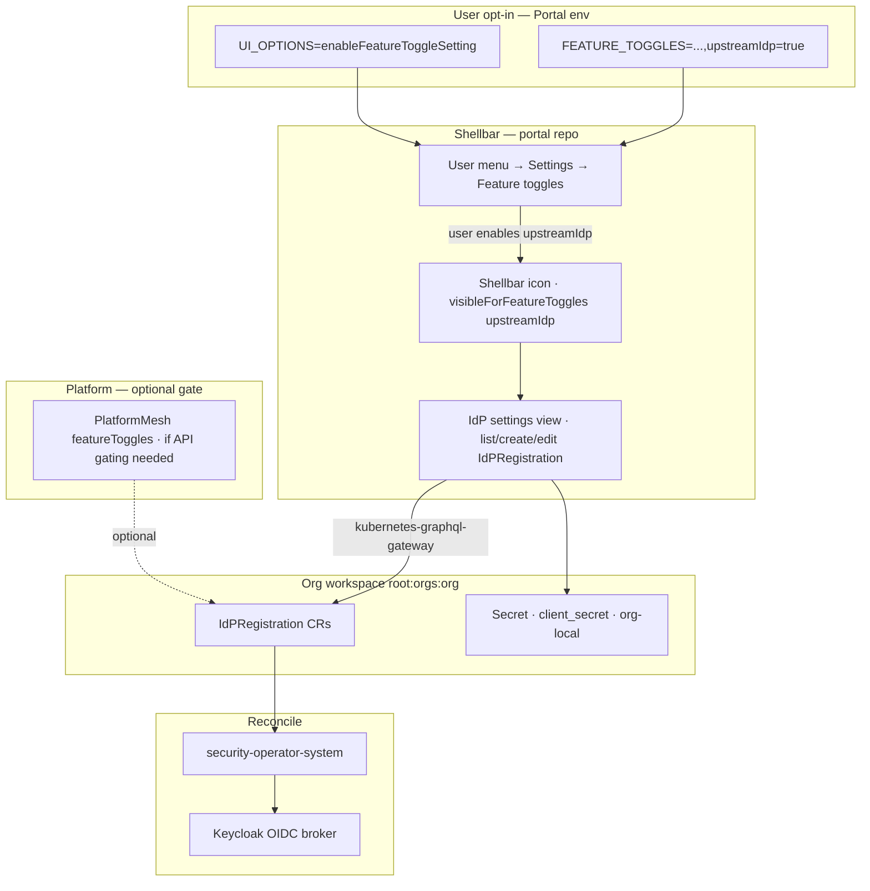

# Upstream IdP UI — integration plan

Plan for org-owner upstream IdP configuration in Portal, using the **shellbar feature-toggle pattern** (same as Terminal) for opt-in, plus generic-resource CRUD for MVP and a dedicated iam-ui wizard later.

**Backend:** [upstream-identity-provider-registration.md](./upstream-identity-provider-registration.md) (authoritative)  
**Reference implementation:** Terminal in `portal/frontend/src/app/services/pm-custom-global-nodes.service.ts`

---

## Target UX

1. User logs into their org in Portal.
2. Opens **user menu (top right) → Settings**.
3. In **Feature toggles**, enables **Upstream identity providers** (opt-in per user, like Terminal).
4. A new **shellbar icon** appears to the left of the user button.
5. Clicking it opens **Identity provider settings** where org **owners** can list, create, edit, and delete one or more `IdPRegistration` resources (upstream OIDC IdPs).
6. Non-owners who enabled the toggle see the entry but get permission errors or an empty/read-only state (FGA enforces at API; UI should hide or disable write actions for non-owners).



---

## Two toggle layers (do not confuse them)

| Layer | Where | Purpose | Terminal example | IdP proposal |
| --- | --- | --- | --- | --- |
| **User toggle** | Portal `FEATURE_TOGGLES` + Settings UI | Per-user opt-in; controls shellbar visibility via `visibleForFeatureToggles` | `terminal=true` | `upstreamIdp=true` |
| **Platform toggle** | `PlatformMesh.spec.featureToggles` | Operator applies optional infra (API exports, extra controllers) | `feature-enable-terminal-controller-manager` | `feature-enable-upstream-idp` **only if** we need to gate API export separately |

**IdP difference from Terminal:** `idpregistrations` is already on `core.platform-mesh.io` APIExport (security-operator). A platform feature toggle may be **unnecessary for MVP** unless product wants to hide the API until GA. Prefer shipping user toggle + owner FGA first; add platform toggle only for rollout control.

---

## Architecture constraints (from design doc)

- **API path:** `kubernetes-graphql-gateway` generic CRUD on `core.platform-mesh.io/idpregistrations` in the org workspace — **not** iam-service GraphQL.
- **Audience:** owner-only writes (FGA on `idpregistrations`); UI must not suggest members can configure IdPs.
- **Secrets:** `clientSecretRef.name` only; Secret lives in org workspace (`default` namespace for MVP). Phase 1 may require pre-creating the Secret; Phase 2 wizard creates it inline.
- **No IDPC merge:** UI edits intent CRs only; operator reconciles Keycloak.

---

## UI feedback and Keycloak status

The UI creates an `IdPRegistration` CR; Keycloak is configured asynchronously by
the security-operator. Feedback uses **two layers**: immediate admission
validation on the API call, and async status after reconcile.

```text
UI create/update
    |
    +-- (1) Admission webhook (sync)
    |       invalid URL / domain / secret ref name
    |       -> GraphQL mutation error -> Luigi alert (immediate)
    |
    +-- CR persisted
          |
          v
    security-operator reconcile
          |
          +-- (2) success -> status.ready=true, organizationId, linkedEmailDomains
          |
          +-- (2) Keycloak failure -> status.ready=false, status.message=<error>
          |
          v
    (3) list watch / (4) detail watch / (5) wizard poll shows result
```

**Do not** call Keycloak synchronously on the create API. Keycloak validation
belongs in reconcile + `status`, not in admission (side effects, latency, retries).

### 1. Immediate feedback (create/update API call)

**Mechanism:** kcp admission → security-operator validating webhook
(`idpregistration_validation_webhook.go`).

**Catches before the CR is stored:**

- Required fields (`alias`, `clientId`, `clientSecretRef.name`)
- Discovery vs manual endpoint mutual exclusion
- HTTPS-only URLs
- Blocked internal/private discovery hosts (SSRF)
- Email domain format when `emailDomainRouting` is set

**UI behaviour:** generic `ResourceService.create` / `update` surfaces webhook
rejections as Luigi error alerts via `alertErrors()` — no custom UI code needed.

**Prerequisite (not wired yet):** register a kcp
`ValidatingWebhookConfiguration` for `idpregistrations` in org logical clusters,
mirroring the existing IDPC webhook at
`platform-mesh-operator/manifests/kcp/04-platform-mesh-system/idpvalidatingwebhookconfiguration-admissionregistration.k8s.io.yaml`.
The handler exists in security-operator; the kcp admission registration is the
gap.

| Task | Owner | Repo |
| --- | --- | --- |
| Add `ValidatingWebhookConfiguration` for `idpregistrations` | platform-mesh | `platform-mesh-operator/manifests/kcp/04-platform-mesh-system/` |
| Extend helm webhook template (when `webhooks.register=true`) | platform-mesh | `helm-charts/charts/security-operator/templates/webhook/` |

**Limitation:** webhook cannot validate Keycloak outcomes (bad client secret,
duplicate broker alias, Organizations API errors). Those appear in `status.message`
after reconcile (section 2).

### 2. Async feedback (Keycloak reconcile result)

**Mechanism:** security-operator `IdPRegistration` subroutine writes status after
each reconcile.

| Status field | UI use |
| --- | --- |
| `status.ready` | Primary success/failure indicator (`readyCondition`) |
| `status.message` | **Show this for Keycloak/operator errors** — contains the actionable text (e.g. `failed to create identity provider: status 400 body: …`) |
| `status.organizationId` | Shown on success when email-domain routing linked a Keycloak Organization |
| `status.linkedEmailDomains` | Domains configured in Keycloak |
| `status.conditions` | Standard `Ready` condition from lifecycle; **message is generic** (“one or more subroutines encountered an error”) — prefer `status.message` for user-facing errors |

On failure the operator calls `setStatus(reg, false, …, err.Error())`; Keycloak
Admin API bodies are included via `readErrorResponse()` in the keycloak client.

**Optional backend improvements** (Phase 3 or parallel hardening):

| Improvement | Benefit |
| --- | --- |
| Parse Keycloak JSON error body into a short `status.message` | Cleaner UI text without raw HTTP bodies |
| Copy reconcile error into `Ready` condition `.message` | Generic UI condition widgets become usable |
| Add `status.phase` (`Pending` / `Ready` / `Failed`) and `status.lastSyncTime` | Explicit wizard/list states |

### 3. Generic UI — list as primary feedback surface (Phase 1)

**Mechanism:** ContentConfiguration `readyCondition` + list columns; generic list
view already subscribes to resource changes when the user has `watch` permission
(`resource-table-card.component.ts` → `resourceChangeSubscription`).

**ContentConfiguration requirements** (extend §1.3):

```json
"readyCondition": {
  "jsonPathExpression": "$.status.ready",
  "property": ["status.ready"]
}
```

List columns (in order):

1. `readyCondition` column — `displayAs: "alert"` (prepended automatically by generic UI when `readyCondition` is set)
2. `spec.alias`, `spec.displayName`, `spec.enabled`
3. `status.message` — label **Keycloak status**, truncated in list

Detail view status group (full `status.message`, not truncated):

- `status.ready`, `status.message`, `status.organizationId`,
  `status.linkedEmailDomains`, `status.conditions`

**Create flow (Phase 1):** generic create closes the dialog on successful
mutation only; it does **not** wait for reconcile. User sees the new row appear
via list watch within a few seconds with ready icon + message. Document this in
UX copy: *“Saving registers the provider; Keycloak configuration may take a few
seconds.”*

**FGA:** owners already have `watch_core_platform-mesh_io_idpregistrations` in
the security-operator FGA model — required for live list updates.

### 4. Detail view watch and post-create navigation (Phase 1.5 / Phase 2)

**Gap:** generic detail view reads once on load and does not watch; opening detail
immediately after create may show empty status until manual refresh.

| Phase | Deliverable |
| --- | --- |
| **1.5** | Rely on list watch for MVP; optional note in create success toast |
| **2** | After wizard create: navigate to detail route; detail view polls or watches until terminal status |
| **2+** | Add watch subscription to generic detail view (same pattern as list) — benefits all reconciled CRs |

**Post-create navigation (Phase 2 wizard):** on successful `createIdPRegistration`
mutation, route to `/organization/identity-providers/:name` and start the
reconcile waiter (section 5).

### 5. Phase 2 wizard — reconcile waiter with timeout

After creating the `Secret` (if inline) and `IdPRegistration`, show a
**Configuring in Keycloak…** state until reconcile reaches a terminal outcome.

**Implementation:** poll or GraphQL watch on the named `IdPRegistration` in the
org workspace. Prefer **watch** when available; fall back to **poll every 2s**.

**Terminal states** (stop waiting):

| Condition | UI |
| --- | --- |
| `status.ready === true` | Success — show linked domains / org id; offer “Test login” link |
| `status.ready === false` && `status.message` non-empty | Failure — show `status.message` in error banner |
| User navigates away | Cancel waiter; list watch continues in background |

**Non-terminal** (keep waiting): `status.ready === false` && `status.message`
empty/omitted — reconcile still running or pending.

**Timeout:**

| Parameter | Value | Rationale |
| --- | --- | --- |
| **Poll interval** | `2s` | Responsive without hammering gateway |
| **Max wait** | **`90s`** | Operator discovery HTTP client timeout is **30s** (`HttpClientTimeoutSeconds` default); headroom for Keycloak broker create/update, Organizations linkage, and one `clusterNotReadyRequeue` (5s) |
| **On timeout** | Warning (not hard error) | Message: *“Configuration is taking longer than expected. The provider may still be applied — check the list for status.”* Keep detail/list open; list watch may still deliver success after timeout |

**After timeout:** disable spinner; show link to detail view; do **not** delete
the CR. Optionally expose a **Retry** action (re-save spec or add
`metadata.annotations` refresh if operator supports it later).

**Do not** block the mutation response on this waiter — start it only after the
create mutation succeeds.

**Optional (Phase 3):** “Test discovery URL” button — server-side dry-run
(discovery fetch + schema check only, no Keycloak write) before create; separate
from the post-create waiter.

---

## Phased delivery

### Phase 0 — Prerequisites (backend / env)

**Goal:** GraphQL and FGA ready before any UI work.

| Task | Owner | Notes |
| --- | --- | --- |
| Deploy `feat/upstream-idp` backend to dev | platform-mesh | security-operator, CRD, APIExport, FGA model |
| Verify `idpregistrations` in gateway playground | platform-mesh | Org workspace, owner token vs member token |
| Register validating webhook for `idpregistrations` | platform-mesh | kcp `ValidatingWebhookConfiguration` — see §1 |
| Confirm `--idp-realm-deny-list=default` in prod paths | platform-mesh | Platform realm must not use tenant IdP feature |
| Document Secret pre-create for Phase 1 | platform-mesh | Runbook: `client_secret` key, same namespace as CR |

**Exit criteria:** Owner can create/list/patch/delete `IdPRegistration` via GraphQL; member denied; invalid spec rejected at admission with webhook message.

---

### Phase 1 — Shellbar toggle + generic CRUD (MVP)

**Goal:** Org owners manage upstream IdPs via Portal with minimal new UI code. **~1–2 sprints.**

#### 1.1 Portal — register user feature toggle

**Repo:** `portal`, `helm-charts/charts/portal`

| Change | File / location |
| --- | --- |
| Add toggle to env | `backend/.env-example`: append `upstreamIdp=true` to `FEATURE_TOGGLES` |
| Helm dev/demo profile | `helm-charts/local-setup/...` or portal chart values overlay: `featureToggles: "enableSessionAutoRefresh=true,upstreamIdp=true"` (match terminal demo pattern) |
| Production default | Keep `upstreamIdp` **off** until GA; document in CONTRIBUTING |

Toggle id string (must match everywhere): **`upstreamIdp`**

Suggested label in Settings (if configurable via openmfp): **Upstream identity providers** / **Externe Identitätsanbieter**

#### 1.2 Portal — shellbar global nav node

**Repo:** `portal`  
**Pattern:** Copy Terminal node in `pm-custom-global-nodes.service.ts`

```typescript
{
  pathSegment: 'identity-providers',
  label: 'Identity providers',
  icon: 'key', // or 'shield', 'world' — pick with design
  hideFromNav: true,           // not in left nav
  globalNav: true,             // shellbar icon
  visibleForFeatureToggles: ['upstreamIdp'],
  order: 850,                  // before terminal (900) if both enabled
  viewUrl: '/assets/platform-mesh-portal-ui-wc.js#generic-list-view',
  webcomponent: { selfRegistered: true },
  context: { /* resourceDefinition — see 1.3 */ },
}
```

**Open question (implementer choice):**

- **Option A (recommended):** Global nav node with `viewUrl` + `webcomponent` opens IdP list in main content area (Luigi navigation). Simpler than Terminal’s custom panel.
- **Option B:** `onNodeActivation` opens a **persistent panel** (see `portal-ui-lib/.../persistent-panel/`) embedding the same web component — closer to Terminal UX but more wiring.

#### 1.3 ContentConfiguration — IdPRegistration resource definition

**Repo:** `platform-mesh-operator`  
**New file:** `manifests/features/feature-enable-upstream-idp-ui/01-platform-mesh-system/contentconfiguration-main-upstream-idp.yaml`  
**Or** ship in main manifests if no platform toggle: `manifests/kcp/01-platform-mesh-system/contentconfiguration-main-upstream-idp.yaml`

Node requirements:

- `visibleForFeatureToggles: ["upstreamIdp"]` on list + detail child routes
- `hideFromNav: true` if shellbar is the only entry point; **or** also add under Settings & Access category for discoverability (optional dual placement)
- `entityType: "main"`
- `context.resourceDefinition` for GraphQL generic UI:

| Field | Value |
| --- | --- |
| apiGroup | `core_platform_mesh_io` |
| entity | `IdPRegistration` |
| entityCollection | `IdPRegistrations` |
| version | `v1alpha1` |
| scope | `Cluster` |

**`readyCondition` (required for list status column):**

```json
"readyCondition": {
  "jsonPathExpression": "$.status.ready",
  "property": ["status.ready"]
}
```

**List view fields (MVP):**

- `readyCondition` column (prepended by generic UI as alert/bool icon)
- `metadata.name`
- `spec.alias`
- `spec.displayName`
- `spec.enabled` (bool icon)
- `status.ready` (bool icon)
- `status.message` (label **Keycloak status**, truncated) — see §2

**Detail view fields:**

- Spec: `alias`, `displayName`, `enabled`, `hideOnLoginPage`, `type`, `oidc.clientId`, `oidc.clientSecretRef.name`, `oidc.discoveryUrl`, manual endpoint fields, `emailDomainRouting`
- Status: `ready`, `organizationId`, `linkedEmailDomains`, `message` (full text), conditions — see §2–§3

**Create view fields:**

- `metadata.name`, `spec.alias`, `spec.displayName`, `spec.enabled`, `spec.oidc.clientId`, `spec.oidc.clientSecretRef.name`, `spec.oidc.discoveryUrl` (required for MVP happy path)
- Omit or read-only: fields operator pins (mappers, validateSignatures, etc.)

**Child route:** `:core_platform-mesh_io_idpregistrationId` → `#generic-detail-view` (same pattern as httpbin example in `helm-charts/local-setup/example-data/.../contentconfiguration.yaml`).

#### 1.4 Owner-only UI gate

FGA already restricts API. UI should avoid confusing members:

| Approach | Effort | Recommendation |
| --- | --- | --- |
| Rely on GraphQL errors only | Low | Acceptable for internal MVP |
| Hide shellbar icon for non-owners | Medium | Query FGA / authz webhook or owner role from portal context |
| Show icon but read-only list | Medium | Better UX for members |

**Defer** full owner gate to Phase 1.5 if timeboxed; **must** have before external GA.

#### 1.5 Platform feature toggle (optional)

Only if product wants cluster-wide kill switch:

| Change | Repo |
| --- | --- |
| Add `case "feature-enable-upstream-idp-ui":` | `platform-mesh-operator/pkg/subroutines/featuretoggles.go` |
| Manifest dir | `manifests/features/feature-enable-upstream-idp-ui/` |
| Local-setup sample | `helm-charts/.../platform-mesh.yaml` `featureToggles` entry |

If `idpregistrations` APIBinding is always present via core export, this toggle applies **ContentConfiguration only**, not the CRD.

#### 1.6 Local-setup / e2e smoke

| Test | Expected |
| --- | --- |
| Owner enables toggle → sees shellbar icon | Icon visible |
| Owner creates Secret + IdPRegistration | List row turns ready within ~90s; broker in Keycloak |
| Owner creates IdP with invalid discovery URL | Admission webhook rejects before CR is stored |
| Owner creates IdP with bad client secret | CR stored; `status.ready=false`, `status.message` shows Keycloak error |
| Member enables toggle → opens UI | Create/patch denied (API + ideally hidden actions) |
| User disables toggle | Icon hidden |

#### 1.7 List watch as reconcile feedback (MVP)

No custom portal code: generic list watch updates rows when operator patches
status (§3). Verify owner token has `watch` on `idpregistrations`.

---

### Phase 1.5 — Detail feedback polish

**Goal:** Better post-create UX without full wizard. **~0.5 sprint**, optional
after Phase 1 MVP.

| Deliverable | Description |
| --- | --- |
| Create success copy | Toast: configuration may take a few seconds; watch list status column |
| Detail status prominence | Ensure `status.message` is visible above the fold on detail view |

Defer detail-view watch subscription to Phase 2 unless generic-ui change is
trivial and shared across resources (§4).

---

### Phase 2 — iam-ui wizard (production UX)

**Goal:** Guided create/edit, inline Secret creation, discovery vs manual endpoints, email-domain routing help. **~2–3 sprints after Phase 1.**

**Repo:** `iam-ui`

| Deliverable | Description |
| --- | --- |
| Routes | `/organization/identity-providers`, `/organization/identity-providers/create`, `/organization/identity-providers/:name` |
| 3-step create wizard | (1) Basics alias/displayName/enabled (2) OIDC clientId + secret create/ref (3) Discovery URL **or** manual endpoints + email domains |
| GraphQL client | kubernetes-graphql-gateway mutations/queries for `IdPRegistration` + `Secret` (not iam-service) |
| Reconcile waiter | After create: poll/watch until terminal status; **90s timeout**, 2s poll interval — see §5 |
| Post-create navigation | Route to detail on successful mutation; show spinner then success/error from `status.message` |
| Owner gate | Hide nav + shellbar target for non-owners using existing org role context |
| i18n | en/de labels; in-app help for discovery vs manual endpoints |

**Shellbar integration:** Point global nav `viewUrl` at iam-ui MFE instead of generic WC, or keep generic list and link “Create” to iam-ui wizard.

**ContentConfiguration update:** Add Settings & Access sibling to Members (like `contentconfiguration-main-iam-ui.yaml`) **when promoting to GA** — shellbar toggle can remain for power users or be removed.

---

### Phase 3 — GA / hardening

| Item | Notes |
| --- | --- |
| Remove experimental user toggle requirement | Either always show shellbar for owners, or move solely to Settings & Access |
| Platform toggle default on | If used |
| Security review | SSRF/discovery URL messaging in UI; never expose raw secret in list/detail |
| Keycloak error parsing | Friendlier `status.message` (§2 optional improvements) |
| Docs | Operator runbook + org-owner user guide |
| kcp `system:` regression test | Backend prerequisite from design doc |

---

## File checklist (Phase 1)

| Repo | Path | Action |
| --- | --- | --- |
| `portal` | `frontend/src/app/services/pm-custom-global-nodes.service.ts` | Add `upstreamIdp` global nav node |
| `portal` | `backend/.env-example` | Add `upstreamIdp=true` to `FEATURE_TOGGLES` |
| `helm-charts` | `charts/portal/values.yaml` or local-setup overlay | Demo: enable `upstreamIdp` |
| `platform-mesh-operator` | `manifests/.../contentconfiguration-main-upstream-idp.yaml` | New ContentConfiguration incl. `readyCondition` + status columns (§3) |
| `platform-mesh-operator` | `manifests/kcp/04-platform-mesh-system/idpregistration-validatingwebhookconfiguration-…yaml` | New — §1 |
| `platform-mesh-operator` | `pkg/subroutines/featuretoggles.go` | Optional platform toggle |
| `helm-charts` | `local-setup/example-data/...` | Sample IdPRegistration + Secret for demo |
| `platform-mesh` | `docs/design/upstream-identity-provider-registration.md` | Link to this plan |

**No changes required:**

- `kubernetes-graphql-gateway` — auto-exposes bound API resources
- `iam-service` — not on the data path
- `security-operator` reconcile + status fields — already implemented; optional message parsing in Phase 3 (§2)

---

## Toggle & naming conventions

| Name | Constant |
| --- | --- |
| User feature toggle id | `upstreamIdp` |
| Platform feature toggle (optional) | `feature-enable-upstream-idp-ui` |
| Shellbar path segment | `identity-providers` |
| ContentConfiguration metadata.name | `main-upstream-idp` |
| GraphQL type prefix | `core_platform_mesh_io` / `IdPRegistration` |

Keep user toggle id **camelCase** to match existing `terminal`, `genericUI`, `os-provider` (note: os-provider uses kebab in CC — prefer camelCase for new toggles in `FEATURE_TOGGLES`).

---

## Risks & mitigations

| Risk | Mitigation |
| --- | --- |
| Generic UI cannot create nested `spec.oidc` cleanly | Test create flow early; fall back to YAML editor or jump to Phase 2 wizard for create |
| Members see shellbar icon and hit 403 | Owner gate in Phase 1.5; FGA is backstop |
| Secret workflow too awkward in Phase 1 | Document runbook; prioritize Secret create in Phase 2 step 2 |
| Toggle proliferation | Remove user toggle at GA; keep platform toggle only if needed for ops |
| Confusion with Members / IAM | Clear labeling: “Identity providers” = how users **log in**; “Members” = who has **access** |
| User thinks create failed when Keycloak is still reconciling | List watch + wizard 90s timeout copy (§3, §5); do not block mutation on reconcile |
| Raw Keycloak HTTP body in `status.message` | Phase 3: parse error JSON in operator (§2) |

---

## Success criteria

- [ ] Org owner enables toggle, opens shellbar IdP settings, creates ≥1 upstream OIDC IdP end-to-end without admin kubeconfig
- [ ] List shows `status.ready` and Keycloak error in `status.message` when reconcile fails
- [ ] Invalid spec rejected at admission before CR is stored (webhook — §1)
- [ ] Phase 2 wizard shows reconcile progress and respects **90s** timeout (§5)
- [ ] Login via brokered IdP works for that org (manual QA with Dex/Azure test tenant)
- [ ] Org member cannot create/patch/delete `IdPRegistration`
- [ ] Platform / default realm cannot use the feature (deny list enforced)
- [ ] Demo/local-setup documents toggle + sample manifest path

---

## Suggested implementation order

1. Phase 0 — verify gateway + FGA on dev; register `idpregistrations` webhook (§1)
2. ContentConfiguration JSON with `readyCondition` + status columns (§3; test in gateway playground first)
3. Portal `upstreamIdp` toggle + shellbar node
4. Local-setup example Secret + IdPRegistration
5. E2e smoke: admission rejection, async Keycloak error in `status.message`, list watch (§1–§3)
6. Owner-only UI polish (Phase 1.5 — §4)
7. Phase 2 iam-ui wizard with reconcile waiter — **90s timeout**, 2s poll (§5)

---

## Related work (out of scope for this plan)

- `ClientRegistration` (downstream OIDC clients) — separate feature, lower priority per design doc
- Boris federation-hub topology — rejected
- IDPC merge for tenant upstreams — rejected; UI must not expose IDPC
